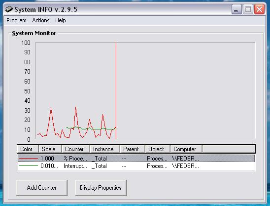



## System Status 2\.0

### Description

This provides you with virtually every piece of information about your computer and any computer that is connected to yours on the network. It has an intuitive interface and allows you to choose how you want to view the information provided, from graphs to histograms and a whole lot of other ways. Please vote for me ... Thank's ..
 
### More Info
 

             |
---                |---
**Submitted On**   |2002-11-15 15:58:24
**By**             |[Robbie  Carter](https://github.com/Planet-Source-Code/PSCIndex/blob/master/ByAuthor/robbie-carter.md)
**Level**          |Advanced
**User Rating**    |5.0 (10 globes from 2 users)
**Compatibility**  |VB 6\.0
**Category**       |[Windows System Services](https://github.com/Planet-Source-Code/PSCIndex/blob/master/ByCategory/windows-system-services__1-35.md)
**World**          |[Visual Basic](https://github.com/Planet-Source-Code/PSCIndex/blob/master/ByWorld/visual-basic.md)
**Archive File**   |[System\_Sta14987711172002\.zip](https://github.com/Planet-Source-Code/robbie-carter-system-status-2-0__1-40799/archive/master.zip)

